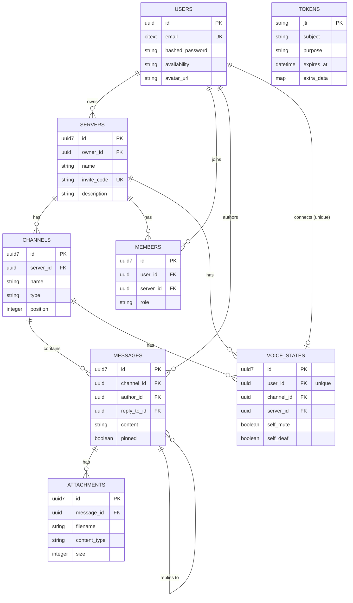

# Banter

A Discord-inspired real-time chat application built with Elixir, Phoenix LiveView, and Ash Framework 3.0. Features live messaging, WebRTC voice channels, user presence, and file uploads.

## Tech Stack

- **Backend:** Phoenix 1.8 + LiveView
- **Data Layer:** Ash Framework 3.0 + PostgreSQL
- **Real-time:** Phoenix PubSub + Phoenix.Presence
- **Auth:** AshAuthentication (password + JWT)
- **Voice:** ex_webrtc (pure Elixir WebRTC SFU — no external media server)
- **Background Jobs:** Oban
- **Assets:** ESBuild + Tailwind CSS + DaisyUI

## Prerequisites

- Elixir 1.15+
- Erlang/OTP 26+
- PostgreSQL 14+
- Node.js 18+ (for asset compilation)

## Local Setup

### 1. Clone and install dependencies

```bash
git clone https://github.com/your-username/banter.git
cd banter
mix setup
```

`mix setup` installs Elixir dependencies, creates and migrates the database, and builds assets.

### 2. Configure environment variables

Create a `.env` file in the project root:

```bash
metered_username=your_metered_username
metered_password=your_metered_password
```

> **TURN server credentials (required for voice across different networks)**
>
> Voice channels use WebRTC. On the same local network STUN is sufficient, but across different networks or mobile data you need a TURN relay. The app is configured to use [Metered](https://www.metered.ca/) as the TURN provider.
>
> 1. Sign up for a free account at [metered.ca](https://www.metered.ca/)
> 2. Create a TURN server in their dashboard
> 3. Copy your **username** and **credential** into `.env`
>
> Without TURN credentials the app still runs fully — voice will work between devices on the same LAN but may fail across different networks.

### 3. Generate self-signed TLS certificates

WebRTC requires HTTPS. Generate a local certificate:

```bash
mix phx.gen.cert
```

This creates `priv/cert/selfsigned_key.pem` and `priv/cert/selfsigned.pem`. Your browser will show a security warning for the self-signed cert — accept it to continue.

### 4. Start the server

```bash
export $(cat .env | xargs) && mix phx.server
```

The app runs on two ports:

- **HTTP:** [http://localhost:4000](http://localhost:4000)
- **HTTPS:** [https://localhost:4001](https://localhost:4001) ← use this for voice channels

## Features

- **Real-time messaging** — messages appear instantly for all users via PubSub
- **Message edit & delete** — author-only, propagated in real-time to all connected clients
- **Voice channels** — WebRTC audio with mute/deafen controls, powered by a pure-Elixir SFU
- **User presence** — online/away/do-not-disturb/invisible status with multi-tab support
- **File uploads** — attach images to messages (stored locally)
- **Server system** — create servers, invite others via invite code, manage channels
- **Dark/light theme** — toggle in the sidebar, persisted across sessions
- **Mobile-friendly** — responsive layout with slide-out sidebar

## Database

The app uses PostgreSQL with the database name `banter_dev` by default. Credentials in `config/dev.exs` default to `postgres/postgres` on `localhost`.

### Schema

Eight Ash resources — two in the `Accounts` domain, six in `Chat` — each mapped straight onto the
Postgres table below it. Primary keys are UUID v7 almost everywhere (time-ordered, no separate
cursor needed for pagination); `users` and `tokens` are the two exceptions, still on a plain UUID
and a JWT `jti` string. Every foreign key is backed by a real Postgres index — `messages` uses a
composite `(channel_id, id)` index to cover both the paginated `by_channel` filter and its sort in
one scan, and `members` has a dedicated `server_id` index since its unique `(user_id, server_id)`
pair isn't a usable prefix for a `server_id`-only lookup.



`tokens` has no drawn relationship above — it's linked to `users` only logically, via the
`subject` claim inside a JWT, not by a real foreign key.

To reset the database:

```bash
mix ash.reset
```

To run migrations only:

```bash
mix ecto.migrate
```

## Environment Variables

| Variable | Required | Description |
|---|---|---|
| `metered_username` | Optional* | Metered TURN server static username |
| `metered_password` | Optional* | Metered TURN server static credential |

\* Optional for basic chat. Required for voice to work across different networks.

All other configuration lives in `config/dev.exs` with defaults suitable for local development.

## Project Structure

```
lib/
├── banter/
│   ├── accounts/          # User resource + auth tokens
│   ├── chat/              # Server, Channel, Message, Attachment, VoiceState resources
│   ├── voice/             # Voice.Room GenServer + ex_webrtc SFU pipeline
│   ├── workers/           # Oban background jobs (voice state cleanup)
│   ├── guild_server.ex    # GenServer per active guild — serializes writes, broadcasts events
│   └── session.ex         # GenServer per WebSocket gateway session
└── banter_web/
    ├── live/
    │   ├── chat_live.ex        # Main chat UI
    │   └── chat/components.ex  # UI components
    └── gateway_live.ex         # WebSocket gateway endpoint
```
